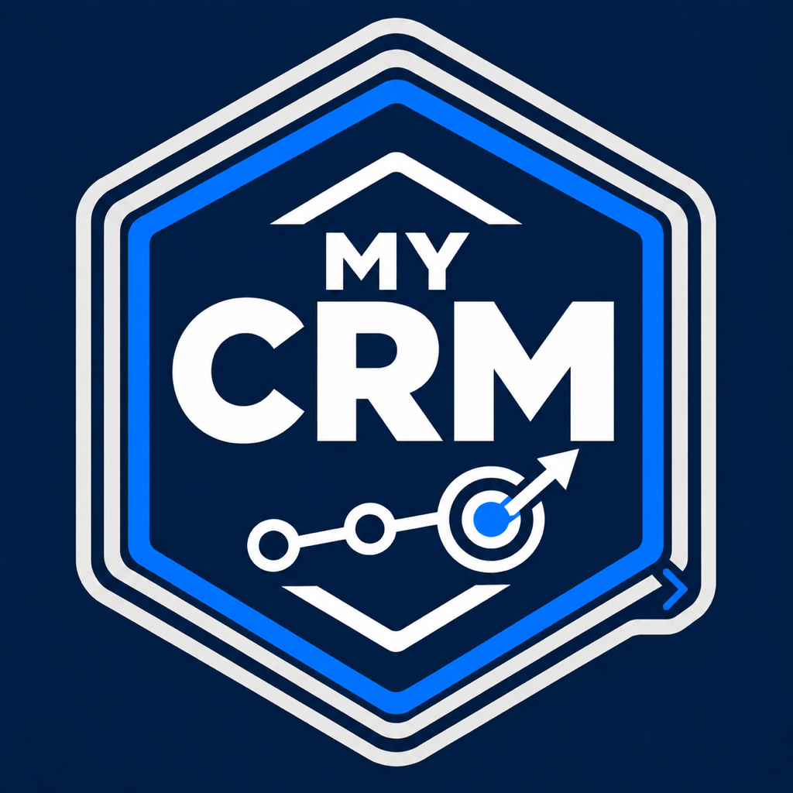

# My CRM for Muse Code



Understand customer records, pipeline status, activity, and next actions across your authorized CRM systems. Requires the separately installed BOS product and its existing authenticated connection. My CRM applies provider-neutral CRM expertise while BOS governs permissions and service execution. Results preserve each source record, evidence, freshness, coverage, conflicts, and partial outcomes; changes across sources are non-atomic. Use only currently discovered operations that are ready in your authorized scope. My CRM can contribute CRM goals and constraints to ad hoc dynamic workflows when the required BOS authoring and runtime contracts are available; BOS owns composition and control. BOS business access is pre-launch and invite-only. Request an invite at https://dfsm.ai/apps/bos/#request-invite; installation does not grant service access.

Install the independently distributed BOS Muse product first and complete its native connection setup.
My CRM uses that single BOS connection and adds no MCP registration, login, or credentials.

From a published My CRM release checkout, run:

```bash
muse plugins validate clients/muse/plugins/my-crm
muse plugins install clients/muse/plugins/my-crm
muse plugins list
```

Start a new Muse session and check `/skills` for the eight My CRM skills.
For updates, sync the published release, run `muse plugins update my-crm`, and start a new session.
Use `muse plugins inspect my-crm` to inspect the installed version and enabled skills.
Package source checks do not establish native login, authenticated operation, or live service readiness.

Manifest reference: https://meta-models.github.io/muse-code-sdk/next/guides/plugins/reference/manifest/
